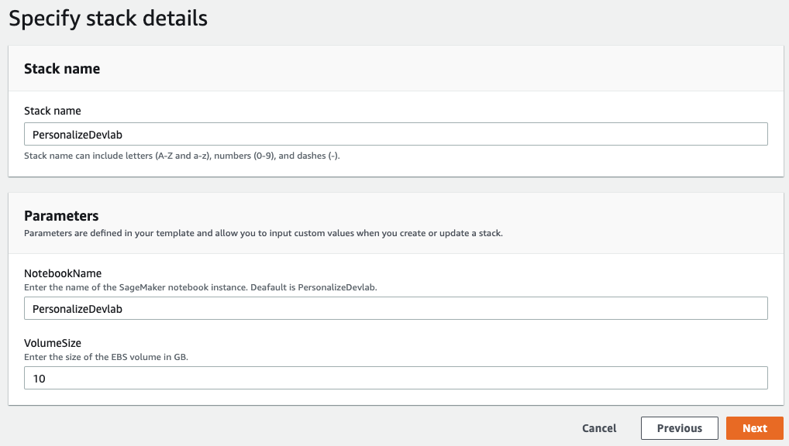

# Amazon Personalize Batch Recommendations Lab
This lab will walk you through on how to train and create batch recommendation using Amazon Personalize. For example, you might what to generate recommendations for a large number of users to be later used for batch-oriented workflows such as sending emails or notifications.

## Introduction
This lab will show you how to setup an end-to-end Personalize batch recommendation.

1. Prepare and import data
2. Create a solution
3. Generate batch recommendation

## Lab Instructions

### Deploying Your Working Environment

The first step is to deploy a CloudFormation template that will perform much of the initial setup work for you. 

1. Download the cloudformation template

Go to the following URL https://raw.githubusercontent.com/dalacan/personalize-batch-recommendations/master/PersonalizeBatchRecommendDevLab.yaml, right click 'Save As' and download the cloudformation template.

**Note** Make sure you save the file as a .yaml file.

2. Create a new cloud formationstack

In another browser window or tab, login to your AWS account. Once you have done that, open the link below in a new tab to start the process of deploying the items you need via CloudFormation.

3. Upload the cloud formation template

Select `Upload a template`,  click `Choose file` and select the cloudformation template file you've just downloaded and then click `Next`.

4. Specify stack details

In this section, **optionally** specify the following options:
    
        1. Stack name - Change the stack name to something more relevant if required.
        2. Notebook name - Change the name of your SageMaker notebook which you will be using if required.
        3. VolumenSize - Set the size of SageMaker EBS volume (default is 10GB). If you expect to load a larger dataset (i.e. if you want to reuse this lab to experiment with larger dataset), increase this accordingly.

When you're done, click the `Next` button at the bottom of the page

5. Configure stack options

All of the defaults in this section will be sufficient to complete the lab. If you have any custom requirements, please alter as required. Once you're done, click the `Next` button to continue.

Finally, in the next section, scroll to the bottom of the page and check the checkbox to enable the template to create IAM resources and click the `Create stack` button.

It will take a few minutes to provision the resources required for the lab. Once it is completed, navigate to the `SageMaker` service by clicking `Services` in tht top of the console and then search for `SageMaker` and click on the service.

6. Launch the SageMaker notebook

Click on Notebook instance and open the `PersonalizeDevLab` notebook (or the name of the notebook you provided in Cloudformation) by clicking `Open JupyterLab`

### Start the lab

Open the notebook `PersonalizeDevLab.ipynb` to start the lab.

Also included is a completed notebook, `PersonalizeDevLab-Completed.ipynb` showing the answers and results if you would like to a notebook with the completed steps.

## Cleanup
Once you're done with the lab, please make sure you follow the instructions at the end of the notebook to delete all the resources you created in your AWS account. Once you have done that, go to the **CloudFormation** service in the AWS console and delete the `PersonalizeDevLab` stack.

---

## References
- [Personalize Product Page](https://aws.amazon.com/personalize/)
- [Personalize Documentation](https://docs.aws.amazon.com/personalize/latest/dg/what-is-personalize.html)
